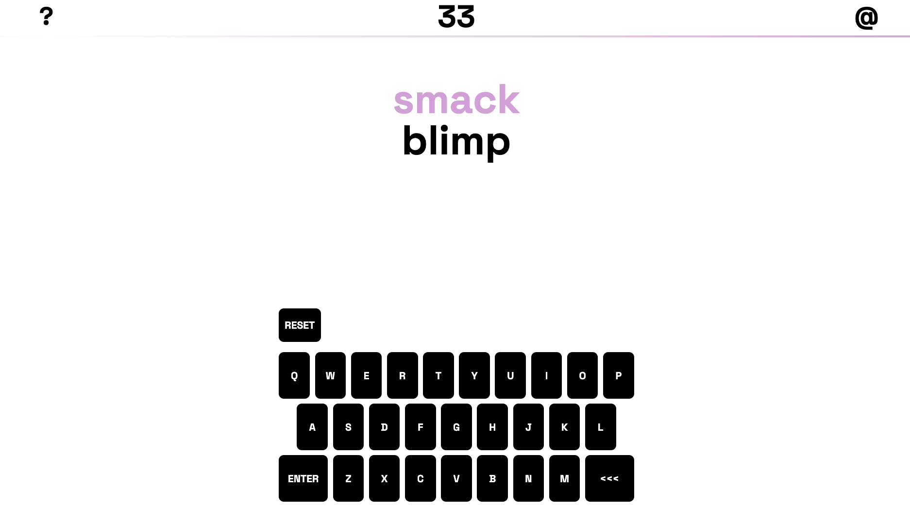

# "33"

## About
"33" is a new word game/puzzle that challenges players to "morph" words into other words - for fans of crosswords, NYT spelling bee, wordle, etc. This project was made with html, css, and vanilla javascript. It is responsive and works great on mobile devices as well as desktops.

## Description
Users are first presented with some simple instructions and a start button. Presssing the start button will start the clock and take them to the game screen. When they've completed the puzzle, they will get their final stats to compare with friends. They will also have the option at this point to play another round. At any point the user can click the "?" in the top-left corner for a more detailed "how to play." The "@" in the top-right corner is my contact info.

## License

  
This project is licensed under the MIT License.
  
For more information on this license, please visit [their website](https://www.mit.edu/~amini/LICENSE.md)

 ## Installation
No installation required.

## Usage
Visit the deployment on GitHub pages.

## Contributions
Any development feedback welcome at the email below!

## Questions
- email: teddysahr@gmail.com
      
      
        
